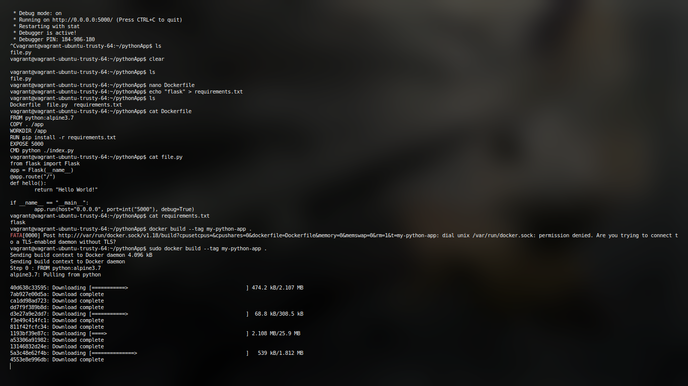
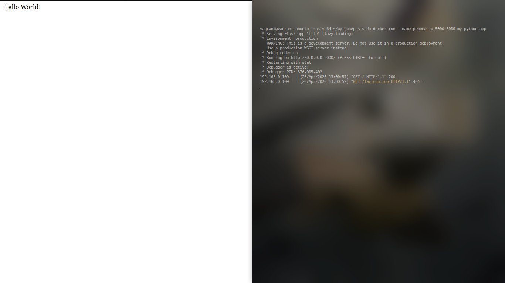

# Assignment 2

### Run a python program using DockerFile

Install flask (or requried dependencies for your programs) 
and write your respective code in file. 
Since you will be using pip for installing dependencies simply go ahead and write a requirements.txt as well

`echo "flask" > requirements.txt `

Code

```
from flask import Flask
app = Flask(__name__)
@app.route("/")
def hello():
    return "Hello World!"
if __name__ == "__main__":
    app.run(host="0.0.0.0", port=int("5000"), debug=True)
```

Now simply create a Dockerfile with the following content

```
FROM python:alpine3.7
COPY . /app
WORKDIR /app
RUN pip install -r requirements.txt
EXPOSE 5000
CMD python3 ./file.py
```


Now all thats left is to build the image and run it. 



Docker container running like pewpew :D 


