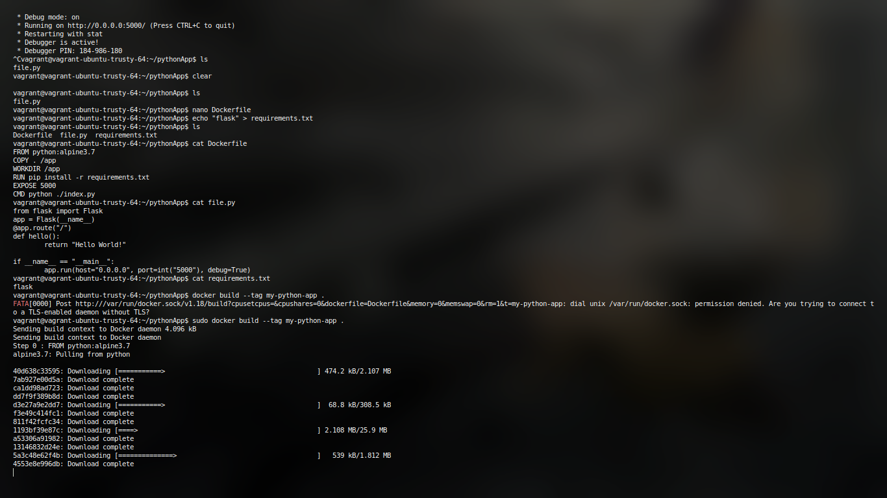

| Name        | Abhishek Upadhyay |
| ----------- | ----------------- |
| Class       | BE IT A           |
| Roll Number | 47                |

# Devops Assignments

# Assignment 2

1. Dockerfile to host a DB server. 

2. Dockerfile to run a python3 program.
   
   ### Dockerfile to host a DB server.

`Create a Dockerfile to basically pull MARIADB and required fs from server`

```
# MariaDB 10.3 with SSH
# Pull the mariadb latest image
FROM mariadb:latest
# List all the packages that we want to install
ENV PACKAGES openssh-server openssh-client
# Install Packages
RUN apt-get update && apt-get install -y $PACKAGES
# Allow SSH Root Login
RUN sed -i 's|^#PermitRootLogin.*|PermitRootLogin yes|g' /etc/ssh/sshd_config
# Configure root password
RUN echo "root:root123" | chpasswd
```


Then simply run the following to run container
`docker build --rm=true -t severalnines/mariadb-ssh .`
then 
`docker images`


`
cd ~/Docker
mkdir datadir
mkdir configure
tail -1 /etc/mysql/my.cnf
!includedir /etc/mysql/conf.d/
`
Then execute the following to run container. 

```
docker run -d --name mariadb1 \
-p 33061:3306 \
-v ~/Docker/mariadb1/config:/etc/mysql/conf.d \
-v ~/Docker/mariadb1/datadir:/var/lib/mysql \
-e MYSQL_ROOT_PASSWORD=root123 \
-e MYSQL_DATABASE=dbtest \
mariadb
```


# Question 2

### Run a python program using DockerFile

Install flask (or requried dependencies for your programs) 
and write your respective code in file. 
Since you will be using pip for installing dependencies simply go ahead and write a requirements.txt as well

`echo "flask" > requirements.txt `

Code

```
from flask import Flask
app = Flask(__name__)
@app.route("/")
def hello():
    return "Hello World!"
if __name__ == "__main__":
    app.run(host="0.0.0.0", port=int("5000"), debug=True)
```

Now simply create a Dockerfile with the following content

```
FROM python:alpine3.7
COPY . /app
WORKDIR /app
RUN pip install -r requirements.txt
EXPOSE 5000
CMD python3 ./file.py
```


Now all thats left is to build the image and run it. 



Docker container running like pewpew :D 


