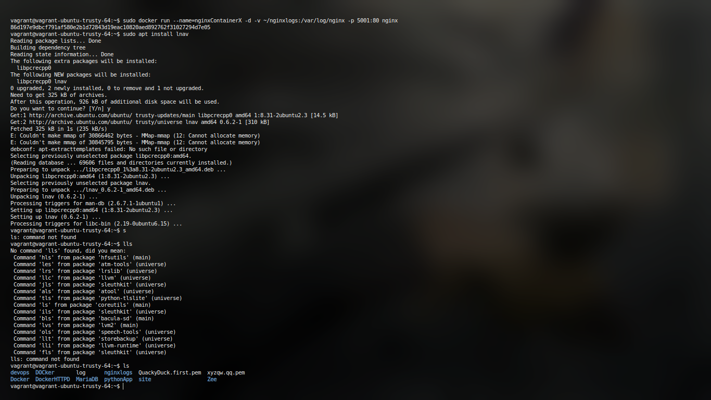
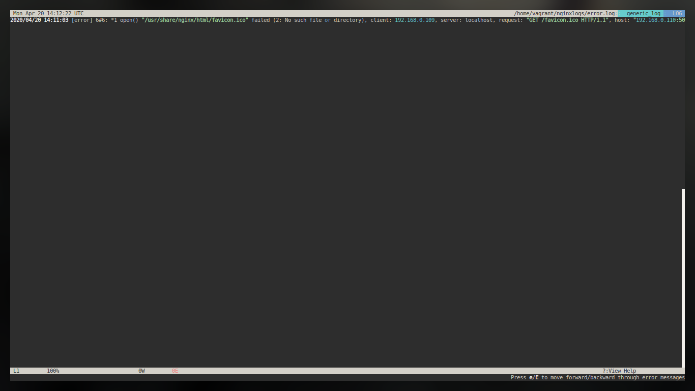
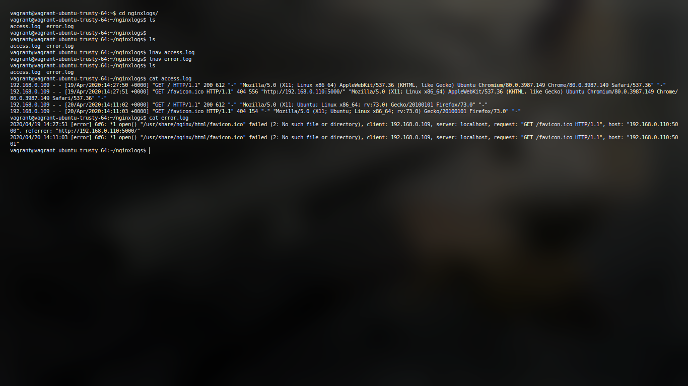
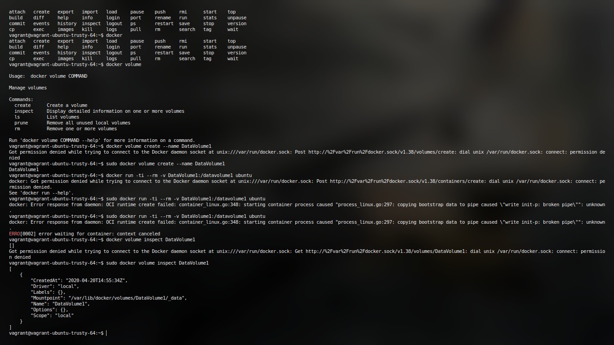

# Devops Experiment 7

# Experiment 7

### To share data between host and docker using Volume.

In general, Docker containers are ephemeral, running just as long as it takes for the command issued in the container to complete, this is an important feature as well as a limitation. By default, any data created inside the container is only available from within the container and only while the container is running, meaning there is close to no standard means to spawn docker container for the standard purpose of programming and development.
A certain method of using volumes can enable the sharing of data. 
Docker volumes can be used to share files between a host system and the Docker container. For example, let’s say you wanted to use the official Docker Nginx image and keep a permanent copy of Nginx’s log files to analyze later. By default, the nginx Docker image will log to the `/var/log/nginx` directory inside the Docker Nginx container. Normally it’s not reachable from the host filesystem.

This example shall help us understand how to achieve the same. 

```
docker run --name=nginx -d\
 -v ~/nginxlogs:/var/log/nginx -p 5000:80 nginx
# --name for naming, -v for mounitng nginxlogs file, 5000:80 is basically for exposing # the port 80 of container as port 5000 of machine
```







With docker 1.9, there comes the capability of creating volumes which allows easy sharing of data between containers

To make use of the volume, we’ll create a new container from the Ubuntu image, using the --rm
flag to automatically delete it when we exit. We’ll also use -v to mount the new volume. -v
requires the name of the volume, a colon, then the absolute path to where the volume should
appear inside the container. If the directories in the path don’t exist as part of the image, they’ll
be created when the command runs. If they do exist, the mounted volume will hide the existing
content:

`docker run -ti --rm -v DataVolume1:/datavolume1 ubuntu`



We can also verify the DataVolume using following

```bash
vagrant@vagrant-ubuntu-trusty-64:~$ sudo docker volume inspect DataVolume1
[
    {
        "CreatedAt": "2020-04-20T14:55:34Z",
        "Driver": "local",
        "Labels": {},
        "Mountpoint": "/var/lib/docker/volumes/DataVolume1/_data",
        "Name": "DataVolume1",
        "Options": {},
        "Scope": "local"
    }
]
```

the output is in json which can be basically parsed using any known language and then can be used for Automation


