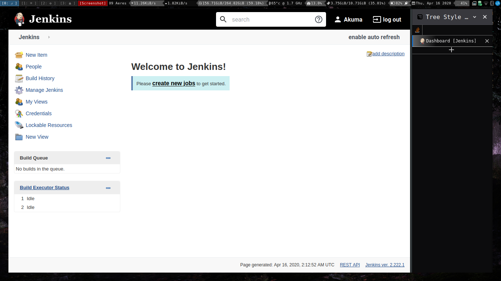
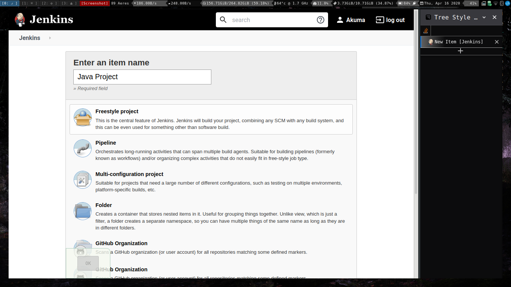
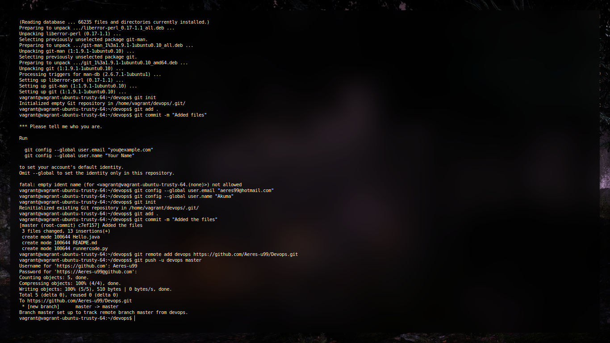

# Devops Study
 # Final Semester Practical

* This is basically meant to record all that I have done for my Devops Experimentation. 
* It must include the problems I faced and how I tackled them 
* The creation of VM will be the first thing
* It must be noted, that since it is to be used for college work **NO weebification**
* The repository is public and should be always available for public access. 

 ## Topics
 ` Create a Vagrant environment for clutterless environment`

1. Introduction to devops (handwritten)
2. Install and Configure Jenkins to test java applications

3. a) Practice shell code execution jenkins
   b) Parameterized programs using Jenkins for java.
   c) Python programs using Jenkins.
4. GIT commands for VCS
5. Install and configure docker
6. Apache web server using docker
    a) Using commandline
    b) Using Docker file (docker compose)
7. Share data between docker container and docker host using docker volumes
8. To share data between docker container using docker volumes
9. Install and configure Puppet software configuration management tool
10. Install and configure ansible push based configuration management tool (use vagrant)
11. LAMP stack configure and deploy using ansible playbook. 
# Create and Configure Vagrant box 
Vagrant is a tool for building and managing virtual machine environments in a single workflow. With an easy-to-use workflow and focus on automation, Vagrant lowers development environment setup time, increases production parity, and makes the "works on my machine" excuse a relic of the past

 ### How to create the setup box for our system? 

Since we just need a plain old ubuntu and we will be taking care of the rest of the installation over commandline, we dont need to be thinking a lot. 

```
vagrant init ubuntu/trusty64
vagrant up
```
This will give us a base machine, but the problem isnt resolved yet.

 ### How to make Servers available on host machine? 

For this purpose I usually go ahead and create the bridge network. Bridge network in simplest term is a VM that doesnt shares the MAC address of host and identifies itself uniquely to the Network. 
Really crucial as it prevents tonnes of portforward and portmaps also allows easier portforward from HOST machine, is it a good idea in production? well we dont know. 

Enabling a bridged network on a virtual machine managed by Vagrant is simple enough, using a single configuration directive in the Vagrantfile:

```
Vagrant::Config.run do |config|
  config.vm.network :bridged
end
```
If you are on an older version (like me :P)
```
config.vm.network "public_network"
```


After this, go ahead and find the private key for ssh
```
❯ vagrant ssh-config
Host default
  HostName 127.0.0.1
  User vagrant
  Port 2222
  UserKnownHostsFile /dev/null
  StrictHostKeyChecking no
  PasswordAuthentication no
  IdentityFile /home/akuma/SoopaProject/devops/.vagrant/machines/default/virtualbox/private_key
  IdentitiesOnly yes
  LogLevel FATAL
```
Use this key for ssh and with X forward 
```
ssh -X vagrant@127.0.0.1 -i /home/akuma/SoopaProject/pewpew/devops/.vagrant/machines/default/virtualbox/private_key
```

And you will be dropped in the shell. 
You can go ahead and install necessary tools like tmux and stuffs. 
# Installing and Configuring Jenkins
 ### Aim:
Installation and Configuration of Jenkins

 ### Procedure and Screenshots.

Jenkins is an open source automation server that has become a crucial component in the likes of Kubernetes and GitOps. Jenkins enables the continuous integration and delivery of software. Jenkins includes a number of plugins to help the automation of building and deploying your applications. 

Steps for Installation: 
1. First of all, jenkins **needs** jdk, so on ubuntu vm of ours go ahead and issue: 
```
sudo apt update && sudo apt install default-jdk 
#if on ubuntu server, default-jdk-headless
#Once the installation finishes check the java version by, 
java -version.
```


2. Download and install the necessary GPG key with the command 
```
wget -q -O - https://pkg.jenkins.io/debian/jenkins.io.key | sudo apt-key add -
```
3. Add the necessary repository with the command 
```
sudo sh -c 'echo deb http://pkg.jenkins.io/debian-stable binary/ > /etc/apt/sources.list.d/jenkins.list'
```
4. Add the universe repository with the command 
```
sudo add-apt-repository universe
```
5. Update apt with the command ```sudo apt-get update```
6. Install Jenkins with the command
```
sudo apt-get install jenkins -y
```
Allow the installation to complete.


 #### How to access Jenkins?

1. Open a web browser and point it to http://SERVER_IP:8080 (where SERVER_IP is the IP address of the hosting server). 

2. You will then be prompted to copy and paste a password that was created during the Jenkins installation. To retrieve that password, go back to the terminal window and issue the command:

```
sudo less /var/lib/jenkins/secrets/initialAdminPassword
```


Choose suggested plugins and then 
Create the first user 

Set the deafult path and you will be set to roll with jenkins. 


 ### Testing java applications on jenkins.



After correct configuration and proper build information


 ### Executing python programs using jenkins.


# Git Commands
 ### Git Experiments
 # Aim:
To study and practice commands for GIT and version control system

* Creation of Repository
```
#In a directory
git init
```
* Commiting a change
```
git commit -m "Updated stuffs"
```
* Stashing the change
```
git add . 
```
* Removing the commiting
```
git reset HEAD~
```
* Setting up a github remote
```
git remote add origin <remote url>
```
* Pushing to git remote
```
git push -u origin master
```
* Viewing the log
```
git log -p 
```


# Docker Installation and Configuration for Containerization
 # Aim
To install docker and configure it for containerization. 

 # ScreenShots:

Installation


Fixing installation (for older machines)


Configuration and Containerization

Pulling the docker image.

Running the container.


# Docker+Apache Webserver setup

# Note

