#### How to access Jenkins?

1. Open a web browser and point it to http://SERVER_IP:8080 (where SERVER_IP is the IP address of the hosting server).

2. You will then be prompted to copy and paste a password that was created during the Jenkins installation. To retrieve that password, go back to the terminal window and issue the command:

```

sudo less /var/lib/jenkins/secrets/initialAdminPassword
```

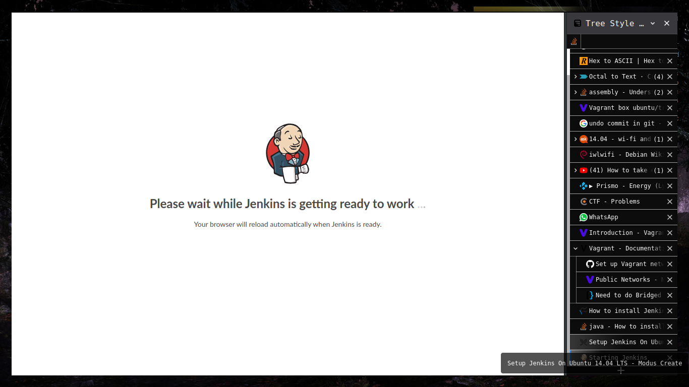

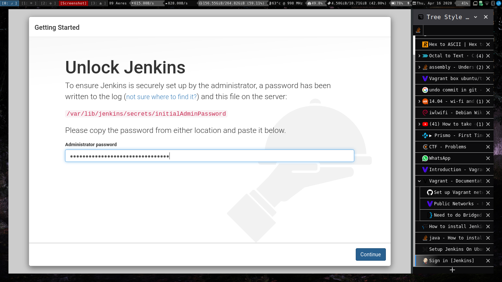

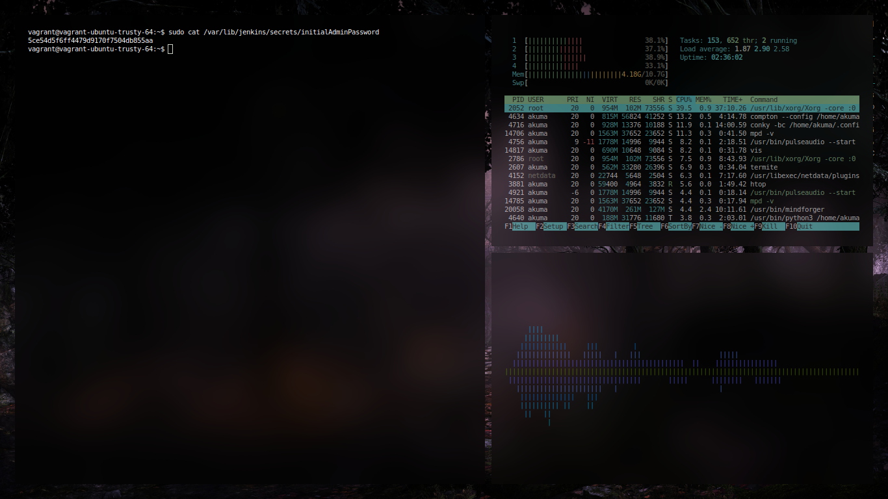

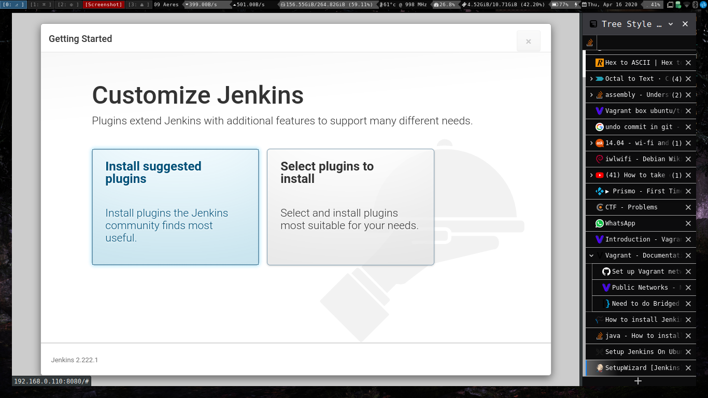

Choose suggested plugins and then

Create the first user

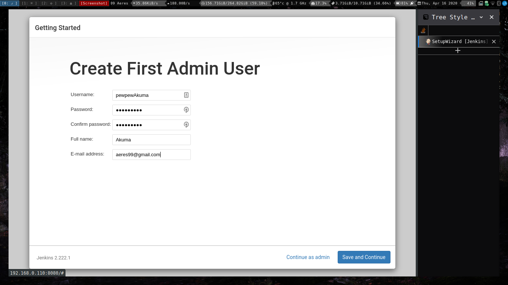

Set the deafult path and you will be set to roll with jenkins.

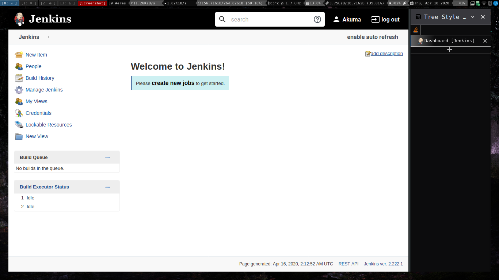

# Experiment 3

# Aim:

### Testing java applications on jenkins. (paramterised and non parameterised)

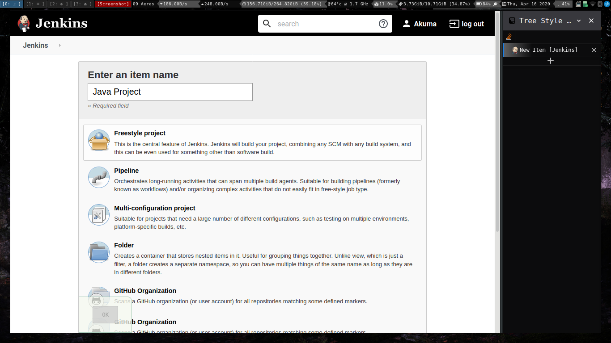

After correct configuration and proper build information

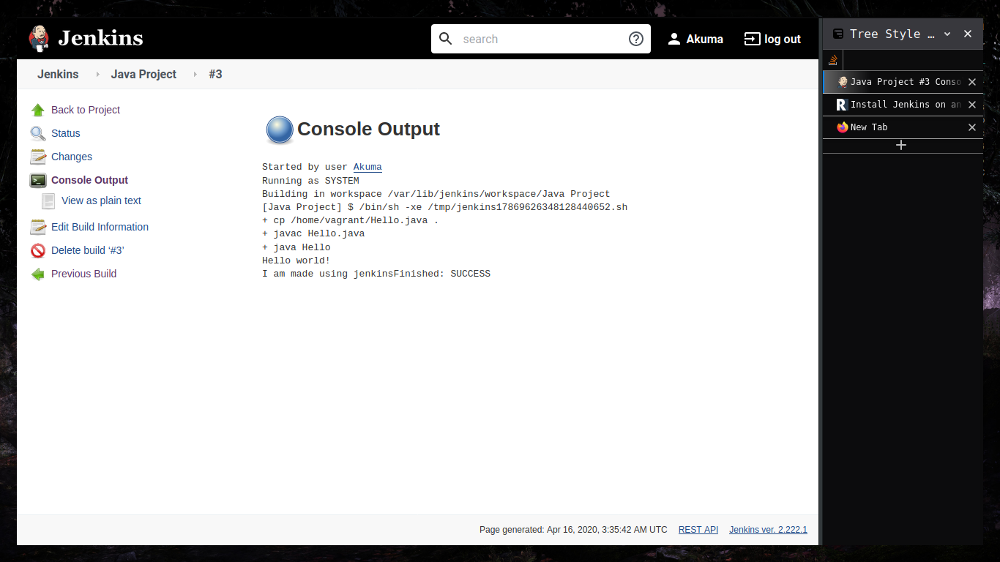

### Java Parameterised.

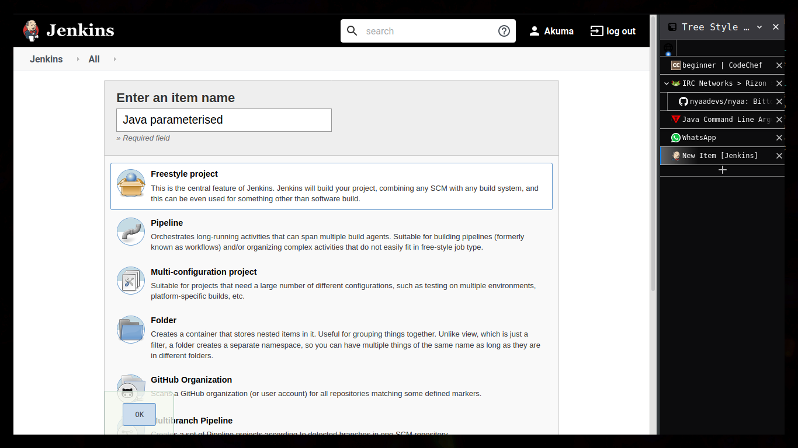

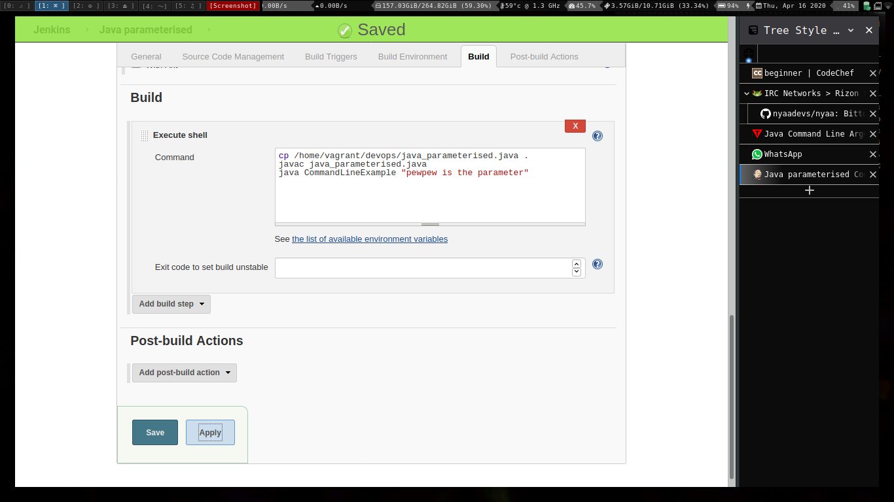

Running the build.

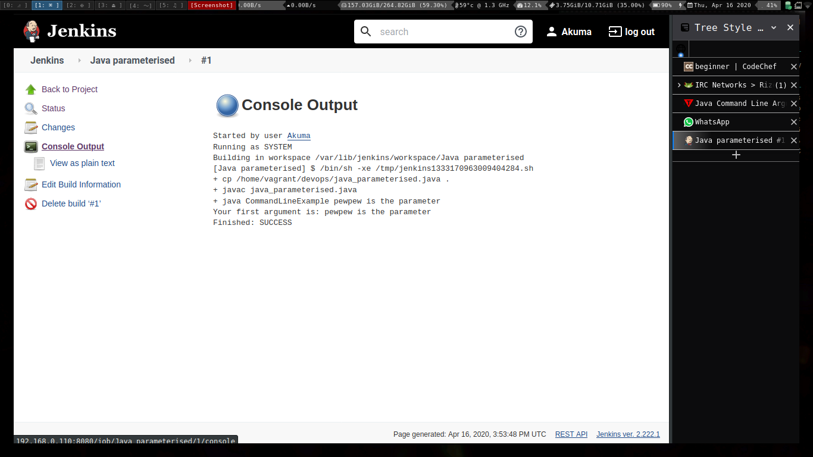

### Executing python programs using jenkins.

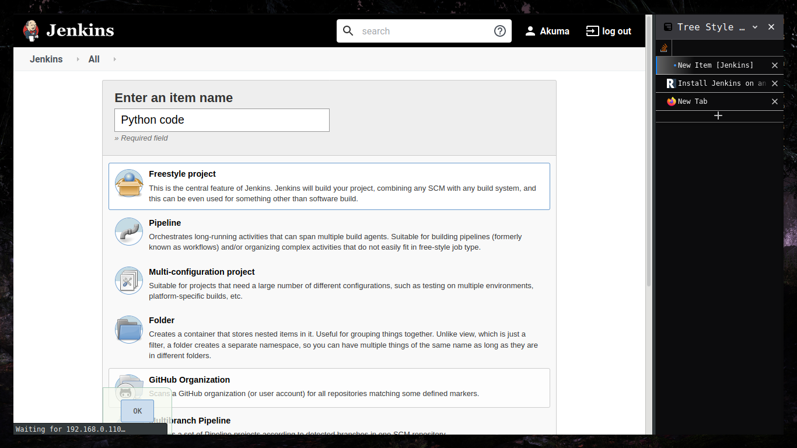

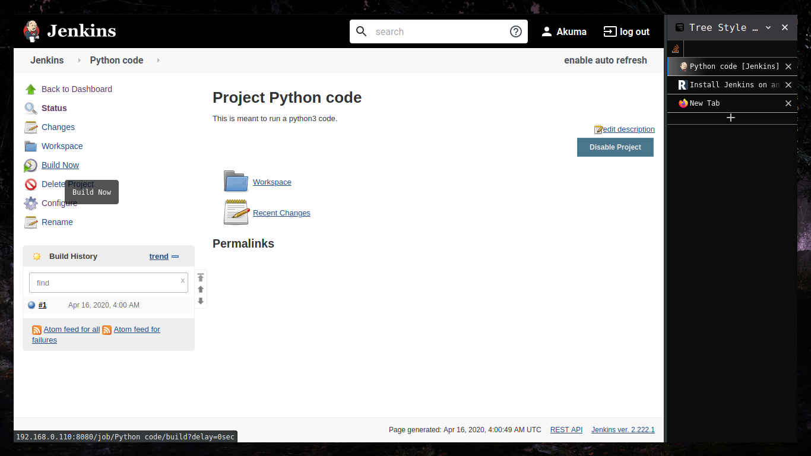

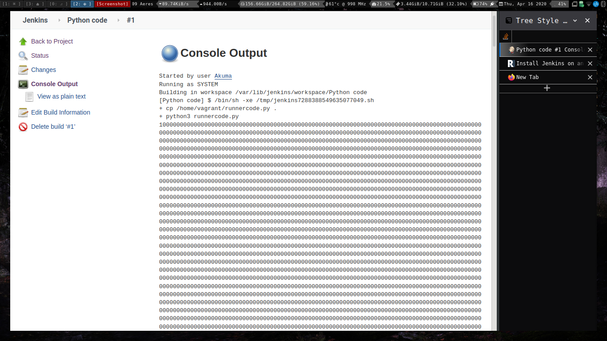


