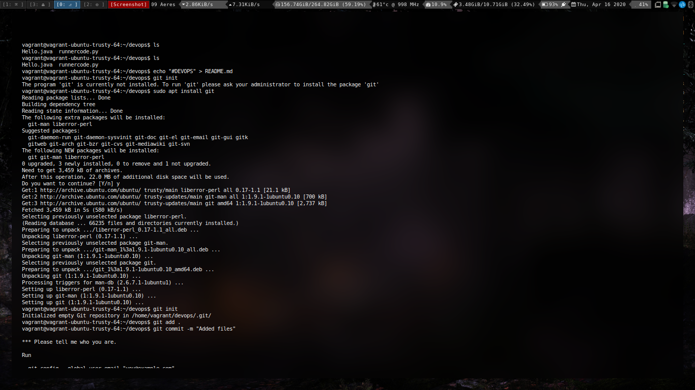
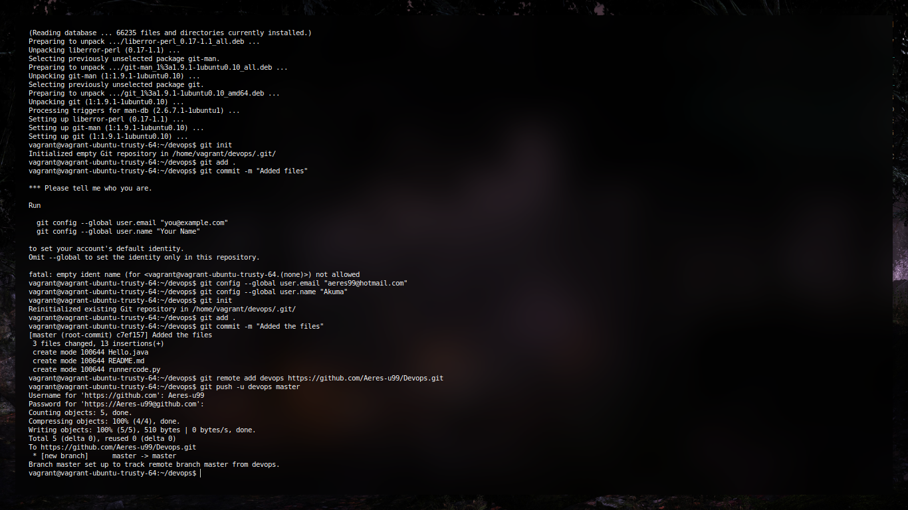

# Experiment 4

### Git Experiments

# Aim:

To study and practice commands for GIT and version control system

* Creation of Repository

```

#In a directory

git init
```

* Commiting a change

```bash
git commit -m "Updated stuffs"
```

* Stashing the change

```bash
git add .
```

* Removing the commiting

```bash
git reset HEAD~
```

* Setting up a github remote

```bash
git remote add origin <remote url>
```

* Pushing to git remote

```bash
git push -u origin master
```

* Viewing the log

```
git log -p
```




