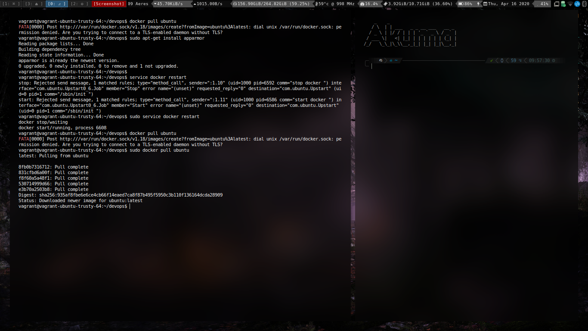

# Experiment 5

# Aim:

To install and configure docker for containerization.

# ScreenShots:

Installation

Fixing installation (for older machines)

Configuration and Containerization

Pulling the docker image.

Running the container.

